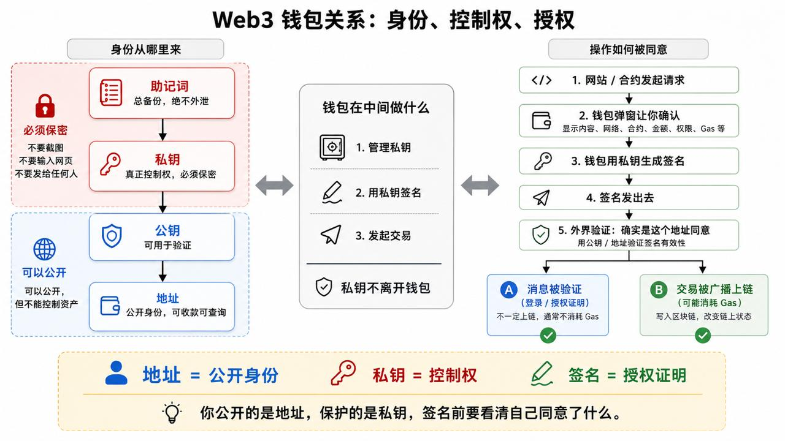

# Daily Note — 2026-05-23

## 今日课程 / 任务来源

- AI × Web3 School 课后自学
- Handbook 首页：https://aiweb3.school/zh/handbook/
- Web3 Cryptography：https://aiweb3.school/zh/handbook/web3/cryptography/
- Web3 Wallet：https://aiweb3.school/zh/handbook/web3/wallet/
- 今日主题：Cryptography + Wallet

## 今日目标

- 理解 Web3 里私钥、公钥、地址、哈希和签名的基本关系。
- 理解钱包不是简单的登录按钮，而是用户管理账户、签名、交易、网络和风险的入口。
- 区分连接钱包、签名消息和发送交易这几类常见钱包动作。
- 建立基本的钱包安全意识：私钥、助记词和签名都不能随便处理。

## 今日核心总结

Web3 不是「注册账号 + 登录网站」，而是：

> 用私钥证明控制权，用签名表达授权，用钱包确认风险。

Cryptography 教我 Web3 的控制权来自私钥和签名；Wallet 教我这些控制权是如何通过钱包界面被使用、确认和保护的。

## 一、Handbook 是什么

AI × Web3 School Handbook 是一个学习手册，不是查交易的网站，也不是钱包。它把 AI 和 Web3 的基础概念拆开讲，适合用来建立知识地图。

今天看的两个方向在 Web3 基础里非常靠前：

- **Cryptography / 密码学**：解释地址、私钥、公钥、签名、哈希这些底层概念。
- **Wallet / 钱包**：解释钱包不只是登录按钮，而是用户管理账户、签名、交易、网络和风险的入口。

## 二、Cryptography：密码学学到了什么

这页最重要的一句话是：

> 链上身份不是平台发给你的，而是你能不能证明自己控制某个私钥。

白话说，在传统互联网里，用户有账号、密码、手机号、客服和找回流程。但在 Web3 里，很多时候没有「客服帮你找回」。谁控制私钥，谁就控制这个地址和里面的资产。

### 1. Private Key / 私钥

**一句话解释：**  
私钥就是我控制钱包的最高权限。谁有私钥，谁就能控制这个地址里的资产。

**生活类比：**  
私钥像保险柜的唯一钥匙，而且不能换锁、不能找客服补办。别人拿到这把钥匙，就能打开保险柜。

**和钱包 / 签名 / 交易的关系：**  
钱包本质上是在帮我保管和使用私钥。我发交易、签名时，钱包会用私钥生成证明，告诉链上：「这个操作确实是这个地址的主人同意的。」所以私钥绝不能截图、发给别人、粘贴到网页或发给 AI。

**检查理解小问题：**  
如果一个网站说「请输入私钥来验证钱包」，我应该输入吗？为什么？

### 2. Public Key / 公钥

**一句话解释：**  
公钥是可以公开的信息，用来验证某个签名是不是由对应私钥生成的。

**生活类比：**  
私钥像印章本身，公钥像大家都能看到的「印章防伪说明」。别人不需要拿到我的印章，也能判断这个章是不是我盖的。

**和钱包 / 签名 / 交易的关系：**  
我用私钥签名后，别人可以通过公钥或地址来验证签名有效。公钥可以公开，但它不是密码，也不能用来直接控制资产。

**检查理解小问题：**  
公钥可以公开，那它能不能拿来转走我的币？

### 3. Address / 地址

**一句话解释：**  
地址就是我的链上收款和识别标识，通常长得像 `0x...`。

**生活类比：**  
地址像银行卡号或收货地址。别人知道它，可以给我转账，也可以查看这个地址的公开链上记录，但不能因此拿走我的钱。

**和钱包 / 签名 / 交易的关系：**  
钱包会显示我的地址。别人给我转币，需要我的地址。我发交易时，链上会显示 From 是哪个地址、To 是哪个地址。但地址只是「门牌号」，真正能控制它的是背后的私钥。

**检查理解小问题：**  
把钱包地址发给别人收款安全吗？那把私钥发给别人安全吗？

### 4. Signature / 签名

**一句话解释：**  
签名就是我用私钥对某个内容表示「我同意」的证明。

**生活类比：**  
签名像我在合同上签字。问题是，Web3 里的「合同」有时写得很复杂，如果我没看懂就签，可能是在同意危险操作。

**和钱包 / 签名 / 交易的关系：**  
钱包弹出签名请求时，我要看清楚自己在签什么。有些签名只是登录，有些签名可能是在授权资产、挂单、允许合约操作我的 Token。签名不一定马上花 Gas，但它可能产生后续权限风险。

**检查理解小问题：**  
钱包弹窗出现 `Sign` 时，它一定只是登录吗？

### 5. Hash / 哈希

**一句话解释：**  
哈希就是数据的指纹，用来证明某个东西有没有被改过。

**生活类比：**  
哈希像文件的指纹或封条编号。原文件只要改一个字，指纹就会变。别人看到同一个指纹，就知道内容没变。

**和钱包 / 签名 / 交易的关系：**  
交易发出去后，会有一个交易哈希，也就是这笔交易的唯一编号。我可以拿它去区块浏览器查交易状态。区块也有区块哈希，合约代码也可以用哈希来检查是否一致。哈希不是加密，不能把哈希「解密」回原文。

**检查理解小问题：**  
交易哈希像不像快递单号？它能不能直接控制我的钱包？

### 一句话总总结

私钥负责控制权，公钥负责验证，地址负责识别，签名负责表达同意，哈希负责证明数据没被改过。

## 三、Wallet：钱包学到了什么

今天重点一句话：

> 钱包不是「登录按钮」，而是我管理链上控制权的工具。它管私钥，帮我签名，替我发交易。

钱包不是一个普通 App，也不是把币存在本地的软件。币其实记录在链上，钱包的作用是证明：这个地址我能控制。

## 四、钱包的三个核心角色

### 1. 钱包是私钥管理器

钱包里真正重要的不是 App 界面，而是它帮我管理私钥或助记词。

人话理解：

- 钱包像钥匙串。
- 地址像门牌号。
- 私钥像开门钥匙。
- 助记词像可以重新生成整串钥匙的总备份。

所以最重要的安全规则是：

> 任何网站、客服、AI、表单让我输入助记词或私钥，都默认危险。

### 2. 钱包是签名工具

签名就是我用钱包证明：

> 这个操作是我同意的。

但签名不一定等于转账，也不一定马上上链。它可能只是登录，也可能是在创建订单、授权某个动作，甚至可能被钓鱼网站利用。

所以看到 `Sign` 时，不能只理解成「登录一下」。更准确地说：

> 签名 = 我对这段内容表达同意。

签名前要看清楚：

- 是哪个网站发起的。
- 要签的内容是什么。
- 有没有 Chain ID。
- 有没有合约地址。
- 有没有额度。
- 有没有过期时间。
- 是不是看不懂的一堆乱码。

如果看不懂，就不要签。

### 3. 钱包是交易发起器

交易是正式向链上提交一个操作。它会被广播到网络，等待节点打包，然后改变链上状态。

常见交易包括：

- 转 ETH
- Swap 换币
- Mint
- Approve Token
- 调用智能合约
- 取消授权

人话理解：

> 点网页按钮只是「提出请求」，钱包 Confirm 之后才是真的准备发到链上。

一笔交易可能经历：

```text
网页点击按钮
→ 钱包弹窗
→ 用户 Confirm
→ 钱包签名
→ 广播到网络
→ 等待打包
→ 成功 / 失败
```

交易通常会消耗 Gas。即使失败，有些情况下 Gas 也可能花掉。

## 五、四个钱包动作要分清

### 1. Connect Wallet / 连接钱包

这只是让网站知道我的地址和当前网络。

它像进门时出示名片：

> 我是这个地址。

它通常不会让网站直接花我的钱。但连接后，网站可以看到我的公开地址、余额、链上记录，也可以继续请求我签名或发交易。

重点记住：

> 连接钱包 ≠ 授权资产。

### 2. Sign Message / 签消息

这是我对一段消息签名。它不一定上链，也不一定花 Gas。

常见用途包括：

- 登录网站
- 证明这个地址是我的
- 同意某个链下订单
- 授权某个动作

风险在于：有些签名看起来像登录，实际可能是在同意某种权限或订单。

重点记住：

> 不花 Gas 不代表没风险。

### 3. Confirm Transaction / 确认交易

这是我确认一笔链上交易。确认后，交易会被广播到区块链网络。

它可能会：

- 改变链上状态
- 转走资产
- 调用合约
- 消耗 Gas
- 成功或失败

重点记住：

> Confirm Transaction 是更重的动作，因为它真的要上链。

### 4. Approve Token / 授权 Token

这是最需要小心的一类交易。

Approve 的意思不是「现在转走 Token」，而是：

> 我允许某个合约以后可以使用我的某种 Token。

比如我授权某个 DEX 使用我的 USDC，之后它才可以帮我完成 Swap。

风险在于：

- 授权可能长期存在。
- 很多网站默认无限授权。
- 如果授权给恶意合约，资产可能被转走。
- 如果项目合约被攻击，旧授权也可能变成风险。

重点记住：

> Approve Token = 给未来开权限，比普通签名和普通连接更危险。

## 六、风险等级排序

从低到高可以这样记：

1. **Connect Wallet**  
   只是暴露地址和网络信息，通常风险较低。

2. **Sign Message**  
   不一定上链，但可能同意危险内容，中等风险。

3. **Confirm Transaction**  
   会上链、会花 Gas、会改变状态，风险更高。

4. **Approve Token**  
   给合约未来动用 Token 的权限，尤其无限授权，是最高风险之一。

## 七、今天最应该记住的东西

1. 钱包不是账号登录器，而是控制权入口。
2. 连接钱包只是让网站知道我是谁。
3. 签名是在表达同意，不一定安全。
4. 确认交易会真的发到链上。
5. Approve Token 是授权未来花我的 Token，要特别小心。
6. 看不懂签名或交易内容，就先不要点。
7. 私钥和助记词绝不能公开，也不能交给任何网站、客服、AI 或表单。

## 八、关系图：身份、控制权、授权



这张图把今天的学习内容串成了一条主线：

### 1. 身份从哪里来

```text
助记词
→ 私钥
→ 公钥
→ 地址
```

我的理解是：

- **助记词** 是总备份，必须保密。
- **私钥** 是真正的控制权，必须保密。
- **公钥** 可以用于验证。
- **地址** 是公开身份，可以收款、可以被查询，但不能控制资产。

所以可以总结为：

> 地址 = 公开身份；私钥 = 控制权。

### 2. 钱包在中间做什么

钱包不是资产本身，也不是普通登录器。钱包在中间主要做三件事：

1. 管理私钥。
2. 用私钥签名。
3. 发起交易。

关键点是：

> 私钥不应该离开钱包。

我不需要把私钥发给网站、合约、客服或 AI。正确流程应该是钱包在本地使用私钥生成签名，然后把签名或交易发出去。

### 3. 操作如何被同意

一笔操作从网站到链上，大概是：

```text
网站 / 合约发起请求
→ 钱包弹窗让我确认
→ 钱包用私钥生成签名
→ 签名发出去
→ 外界用公钥 / 地址验证签名有效性
```

之后可能出现两种结果：

- **消息被验证**：比如登录或授权证明，不一定上链，通常不消耗 Gas。
- **交易被广播上链**：写入区块链，改变链上状态，可能消耗 Gas。

### 4. 今天这张图给我的一句话总结

> 你公开的是地址，保护的是私钥；签名前要看清自己同意了什么。

## 九、今日收获

今天我把 Web3 的账户体系和传统互联网账号体系区分得更清楚了。

传统互联网更像是「平台给我账号，我用密码登录」。Web3 更像是「我通过私钥控制地址，通过签名证明自己同意某个操作」。

我也更理解钱包为什么重要：它不是一个单纯的登录入口，而是用户使用链上资产和权限的核心界面。很多风险不是发生在链上之后才出现，而是在钱包弹窗里确认签名或交易之前就已经开始了。

## 十、我还需要继续理解的问题

- 签名消息为什么不上链也可能危险？
- 普通签名和 EIP-712 结构化签名有什么区别？
- 公钥和地址具体是怎么从私钥推导出来的？
- EOA 和智能合约钱包在权限管理、恢复和安全上有什么差异？
- 如何通过区块浏览器准确判断一笔交易到底做了什么？

## 十一、今日产出

- 阅读并整理了 AI × Web3 School Handbook 中的 Cryptography 和 Wallet 相关内容。
- 用自己的话解释了 Hash、Public Key、Private Key、Address、Signature、Merkle Tree 等密码学概念。
- 梳理了钱包的三个核心角色：私钥管理器、签名工具、交易发起器。
- 区分了 Connect Wallet、Sign Message、Confirm Transaction、Approve Token 四类动作。
- 补充了 Web3 钱包关系图，把助记词、私钥、公钥、地址、签名、消息验证和交易上链串成一条线。
- 建立了更清晰的钱包安全意识：私钥和助记词不能公开；签名、确认交易和 Token 授权都不能随便点击。

## 打卡草稿

今天我继续学习 AI × Web3 School Handbook，重点看了 Cryptography 和 Wallet 两个方向。

我今天最大的理解是：Web3 不是「注册账号 + 登录网站」，而是「用私钥证明控制权，用签名表达授权，用钱包确认风险」。在传统互联网里，账号通常由平台发放，用户可以通过手机号、邮箱或客服找回；但在 Web3 里，谁控制私钥，谁就控制对应地址和资产。

在 Cryptography 部分，我学习了 Hash、公钥、私钥、地址、签名和 Merkle Tree。Hash 像数据指纹，用来证明数据有没有被改过；私钥是控制权本身；地址是链上的公开标识；签名则是用户用私钥对某段内容做出的授权证明。

在 Wallet 部分，我理解到钱包不是简单的登录按钮，而是用户控制链上资产和权限的入口。钱包有三个核心角色：私钥管理器、签名工具、交易发起器。我也区分了四类常见动作：Connect Wallet 只是让网站知道我的地址和网络，不等于授权资产；Sign Message 是对一段内容表达同意，不花 Gas 也可能有风险；Confirm Transaction 会真的发到链上，可能改变状态和消耗 Gas；Approve Token 则是给合约未来使用某种 Token 的权限，尤其无限授权需要特别小心。

今天我也整理了一张 Web3 钱包关系图，把「身份从哪里来」「钱包在中间做什么」「操作如何被同意」这三条线串起来。今天最重要的安全意识是：私钥和助记词绝对不能公开，签名也不能随便点。以后看到钱包弹窗时，我需要认真确认链、合约地址、资产、额度、Gas 和操作目的；遇到不清楚的交易，也要学会用区块浏览器核对链上事实。

## 提交记录

- GitHub 学习仓库：https://github.com/heziwang/ai-web3-school-cohort-wang
- 今日 daily note：`daily/2026-05-23.md`
- 打卡平台链接：https://web3career.build/zh/programs/AI-Web3-School#tab=learning
- 提交时间：待手动提交到打卡平台后补充。
